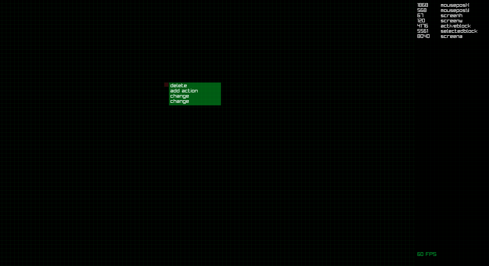

# gamegrid_2d
A basic grid system which shows mouse position XY as well as the number of the highlighted block and selected block (left click).
Includes an automatically resizing left click menu which should adjust in size based on the number of items in the list. Grid size/block numbers should automatically adjust to screen resolution.

<b>F1 key</b> > Show/Hide Left Click Menu / <b>F2 key</b> > Show/Hide 16px Grid / <b>F3 key</b> > Show/Hide 4px Grid / <b>End key</b> > Close Window

  

